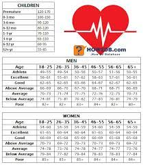

# CSC-212-Final-Project-Description

Project Description: This project anaylzes varies types of medical information for each of the patients written in the CSV file included in the project directory. The CSV file stores the name, sex, age, medical condition, blood pressure, pulse, and DNA sequence of 40 patients (number of patients can be easily changed in line 243 of the main.cpp and by edittin the CSV file). The purpose of this program is to store various medical and identification records of patients to allow medical professionals to treat and analysis the patients better in the hospital. Once the program runs, it will output a chart comparing each DNA sequence to each other using an algorithm described later in this file and the patient in the most need of assistance based on another algorithm also described in this writeup.

# SETUP
This program requires minimal setup and input from the user. It is already to run through the code completely, but will not have the accurrate data, the user needs to successfully use it. In order to change this, the user must input or delete lines ine the CSV file. Each entry must be formatted like the default ones already in the file. This program is only programmed to assess the following conditions: heart attack, stroke, unknown, head injury, broken bone, and stomache pain. Any ages under 1 year must be entered in as 0. The sex can only be "Male" or "Female" for medical purposes. The blood pressure is entered as a fraction "x/y" and the pulse is a number. The code is set up to read the data of the 40 patients already in the file by default. This can be changed by editting the CSV file to hold the data the user gathered. Each line must hold all of the data for only one patient and must be formatted as:                        
full name, sex, age (as an integer), medical condition, blood pressure, heart rate, DNA sequence.

# USE
Once the program is set to run, it will print out a chart with the initials of every patient in the first row and column. It will then, print out the score of each comparison (if it is at the same patient on the row and column, it will print out "--" instead of a number. This program follows a scoring system of: 
* mismatch (ex. A != C) causes the score to be decreased by 1 
* match (ex. A == A) causes the score to be increased by 1
* gap (_) causes no changes to the score                                                                                    				                                                                                                

If the two DNA sequences are not of the same length, the difference between the two lengths are subtracted from the score.

After the table prints out, the information of the first patient that should be treated will print out. The user must type "Treat" to treat and remove the patient from queue. After the patient is treated, the information of the next patient gets printed.        
Sample patient print out:                                                         
Name: John Doe                                                                                                                                                 
Sex: Male                                                                                           
Age: 65                                                                                            
Condition: Stroke                                                                                                                                                                                               
Heart Rate: 89                                                                                            
This process is repeated until there is no more patients to treat. The program will print out "You have treated everyone! There is no more patients waiting!"

# Code Implementation
## Read CSV file function - readCSV(std::string fileName, int numOfPatients, std::string names[], std::string sexes[], std::string ages[], std::string conditions[], std::string bloodPressures[], std::string heartRates[], std::string DNASequences[])
This function is used to read the data in the file and to put each entry in the correct array listed in the parameters of the function. This will allow the program to manipulate and anayzle the data easily later on in the program. This function uses the implementation from the csv file data type. It saves every piece of data in a specific array based on what column the data is in. After it is completed, the file is closed to aviod it being accidently modified while the program is running and only the arrays are used in the program. 

## Calculating the priority of a patient - prioritySetUp(std::string sexes[], std::string ages[], std::string conditions[], std::string bloodPressures[], std::string heartRates[], int numOfPatients, unsigned int priority[])
This function is used to calculate each of the patients who are listed in the file's priority. The patients with a higher priority will show up first while the program is being ran. The priority of each patient starts as 0 before their information is analyzed. Each condition, heart rate, and blood pressure has a priority value. The priority value of the heart rate is also dependent on the sex and age of the patient.                                                                   
Medical Concern:                                                                                                                                                                                                                                                                                                  
* Heart Attack or Stroke: Adds 5 to the priority                                                                                                      
* Head Injury or Unknown: Adds 4 to the priority                                                                                                     
* Bleeding: Adds 3 to the priority                                                                                                                   
* Broken Bone: Adds 2 to the priority                                                                                                                                                 
* Stomach Pain: Adds 1 to the priority                                                                           

Blood Pressure:                                                                                                                                                  
Systolic pressure is the first number in the blood pressure reading and the diastolic pressure is the second.

                                                                                                                                                 
* Hypertensive Critical: Adds 5 to the priority                                                                                                        
* High Blood Pressure Stage 2: Adds 4 to the priority                                                                                                       
* Low Blood Pressure: Adds 3 to the priority                                                                                                                        
* High Blood Pressure Stage 1: Adds 2 to the priority                                                                                                         
* Prehypertension: Adds 1 to the priority                                                                                                                  

Heart Rate:                                                                                                                                        
Uses another function to calculate this for organizational purposes - heartRatesRange(int heartRate, int fstLow, int lstLow, int normLow, int normHigh, int fstHigh, int secHigh, int currentPriority)

* Child 
  * 3 Years Old and Under:                                                                                                                                                  
    * Less than or equal to 30 beats or greater than 150 (0-30, 150 up, including 30): Adds 5 to priority
    * Less than or equal to 150 beats and more than 130 beats (130-150, including 150): Adds 4 to priority
    * Less than or equal to 50 beats and more than 30 beats (30-50, including 50): Adds 3 to priority
    * Less than or equal to 70 beats and more than 50 beats (50-70, including 70): Adds 2 to priority
    * Less than or equal to 130 beats and more than 110 beats (110-130, including 130): Adds 1 to priority
    * Less than or equal to 110 beats and more than 70 beats (70-110, including 110): No change
  * 6 to 3 Years Old:                                                                                                                                                  
    * Less than or equal to 25 beats or greater than 150 (0-25, 150 up, including 25): Adds 5 to priority
    * Less than or equal to 150 beats and more than 130 beats (130-150, including 150): Adds 4 to priority
    * Less than or equal to 45 beats and more than 25 beats (25-45, including 45): Adds 3 to priority
    * Less than or equal to 65 beats and more than 45 beats (45-70, including 70): Adds 2 to priority
    * Less than or equal to 130 beats and more than 110 beats (110-130, including 130): Adds 1 to priority
    * Less than or equal to 110 beats and more than 65 beats (65-110, including 110): No change
